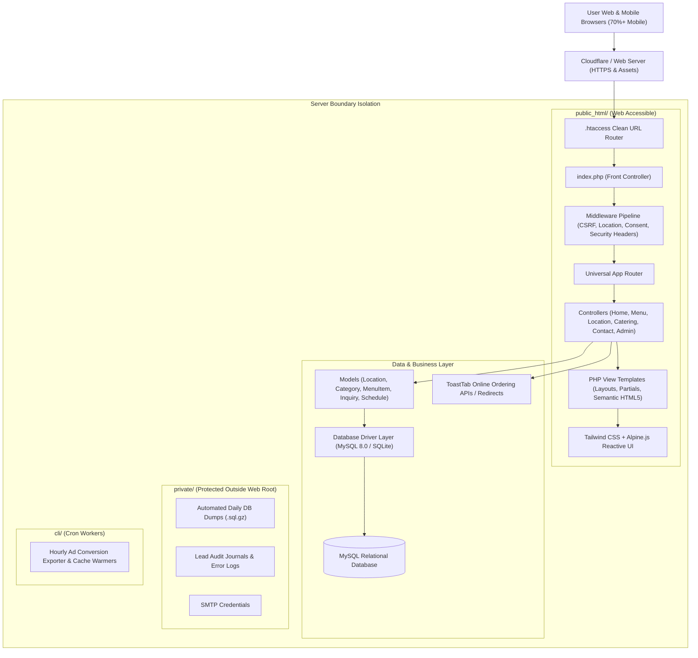
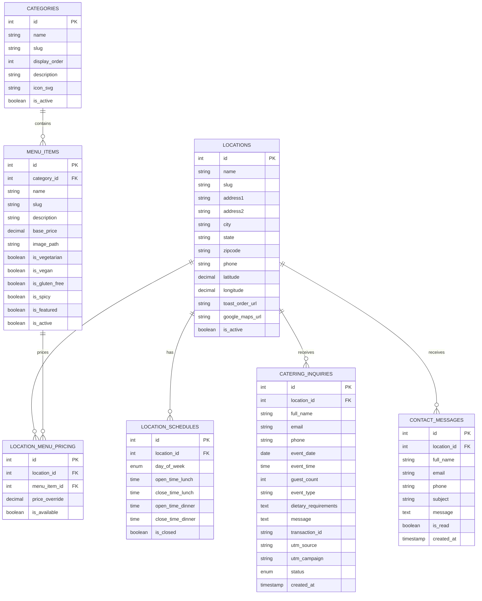
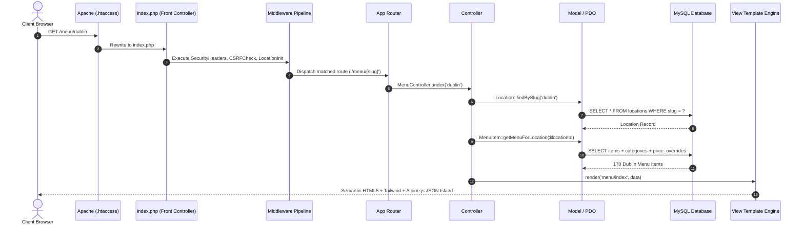

# 🏛️ Enterprise System Design & Technical Architecture
## Project: Biryani Spot Chennai Dosa (Multi-Location Web Platform)

> **Document Purpose**: Establish an immutable, production-grade technical foundation before writing application code. Any AI agent or engineer building this project must follow these architectural patterns, schema contracts, and request lifecycles.

---

## 1. System Overview & Architecture Diagram

The system is built as a high-speed, lightweight, server-isolated **PHP 8.2+ MVC Application** backed by **MySQL 8.0+** (with SQLite local fallback), styled with **Tailwind CSS**, and enhanced with reactive **Alpine.js/Vanilla JS** clientside controllers.



---

## 2. Server Boundary Isolation Standard

In accordance with [`PRODUCTION_DEPLOYMENT_AI_GUIDE.md`](./PRODUCTION_DEPLOYMENT_AI_GUIDE.md), the system strictly isolates web-accessible assets from backend credentials and CLI utilities:

```
/home/<USER>/domains/<DOMAIN>/
├── public_html/                        # ONLY web-accessible folder
│   ├── .env                            # Environment credentials (chmod 0600)
│   ├── .htaccess                       # Apache rewrite gateway & security flags
│   ├── index.php                       # Front controller entry point
│   ├── config/
│   │   ├── app.php                     # App constants, URLs, environment
│   │   └── database.php                # Multi-driver PDO connection
│   ├── src/
│   │   ├── Controllers/                # Request handlers & JSON API responders
│   │   ├── Models/                     # Data entities & database queries
│   │   ├── Middleware/                 # CSRF, Security, Location, Consent
│   │   └── Helpers/                    # Escaping e(), Session, Flash, Sanitizer
│   ├── views/
│   │   ├── layouts/                    # header.php, footer.php, modal.php
│   │   ├── partials/                   # location-picker.php, item-card.php, consent-banner.php
│   │   ├── home/                       # index.php
│   │   ├── menu/                       # index.php, detail.php
│   │   ├── locations/                  # index.php, detail.php
│   │   ├── catering/                   # index.php, success.php
│   │   ├── contact/                    # index.php
│   │   └── admin/                      # login.php, dashboard.php, leads.php
│   ├── assets/
│   │   ├── css/                        # Tailwind build / custom styling
│   │   ├── js/                         # Alpine.js modules (menu filter, location calculator)
│   │   └── images/                     # Food photography, hero banners, icons
│   ├── sitemap.xml                     # Dynamic SEO sitemap
│   ├── robots.txt                      # Crawler directives
│   └── llms.txt                        # AI crawler documentation
│
├── private/                            # PROTECTED (Outside web root)
│   ├── backups/                        # Nightly MySQL dumps
│   ├── logs/                           # System and inquiry error journals
│   └── biryani_local.db                # SQLite database for local offline dev
│
├── cli/                                # PROTECTED (Cron only)
│   ├── migrate.php                     # Database migration runner
│   └── seed.php                        # Database seeder from old_website_data/
│
└── deploy-backups/                     # Rollback release archives
```

---

## 3. Relational Database Schema (MySQL 8.0+ / SQLite)

The database schema is modeled to handle multi-location operations, lunch/dinner schedules, 400+ categorized dishes, location-specific price overrides, and customer lead acquisition:



---

## 4. Request Lifecycle & Routing Architecture

Every web request follows this deterministic lifecycle:



---

## 5. Security & Privacy Hardening

1. **SQL Injection Armor**:
   - 100% of database interactions run through `PDO::prepare()` with bound parameter arrays.
   - `PDO::ATTR_EMULATE_PREPARES => false` enforced to guarantee true server-side prepared statements.
2. **Cross-Site Scripting (XSS) Armor**:
   - Universal output escaping helper `e(string $value): string` wrapping `htmlspecialchars($value, ENT_QUOTES | ENT_SUBSTITUTE, 'UTF-8')`.
3. **Cross-Site Request Forgery (CSRF)**:
   - Session-backed crypto token (`$_SESSION['_csrf_token']`) required on every POST form submission.
4. **Honeypot Anti-Spam Strategy**:
   - Invisible `website_hp` input field on catering and contact forms.
   - Submissions containing any value in this field are silently aborted without saving to DB.
5. **Google Consent Mode v2**:
   - Initial script sets `ad_storage: denied`, `analytics_storage: denied`.
   - On interactive consent acceptance, updates consent status and syncs attribution parameters (`gclid`, `utm_*`).

---

## 6. Performance & SEO Engine

- **Real-Time Location Status Engine**: Lightweight PHP utility calculates whether each location is currently open, closed, or opening soon based on local California time (`America/Los_Angeles`).
- **Menu Search & Filtering**: Pre-rendered on server for search engine crawlers, augmented with instant client-side Alpine.js search (zero network latency when browsing dishes).
- **Rich Schema.org JSON-LD**:
  - `Restaurant` schema with sub-organizations for Dublin, Milpitas, Livermore, Concord.
  - `Menu` and `MenuItem` markup with verified prices and dietary flags.
  - `LocalBusiness` geo-coordinates and weekly opening hours specs.
- **Image Optimization**: Static images served directly with aggressive cache headers (`Cache-Control: public, max-age=31536000, immutable`).

---

## 7. Migration & Seeding Pipeline

To ensure the new website initializes with complete accuracy, the seeder reads directly from `old_website_data/`:
1. `cli/migrate.php`: Idempotently executes `database/schema.sql`.
2. `cli/seed.php`: Parses `old_website_data/data/locations.json` and `old_website_data/data/menus_by_location.json`, inserting all 4 locations, weekly schedules, 32 categories, and 426 unique dishes with per-location prices.

---
*Certified for implementation in Biryani Spot Chennai Dosa project.*
